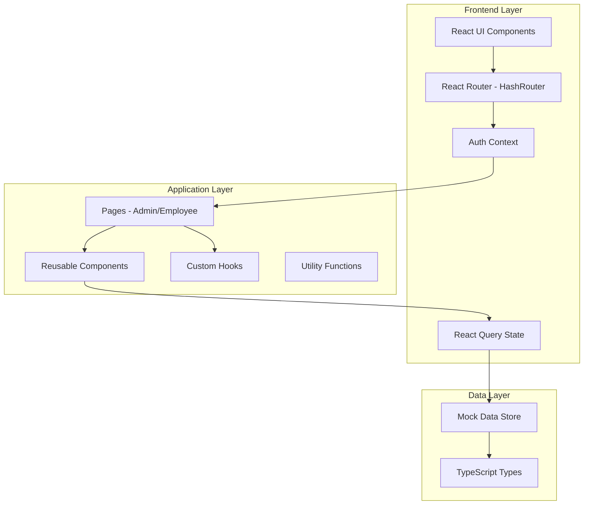
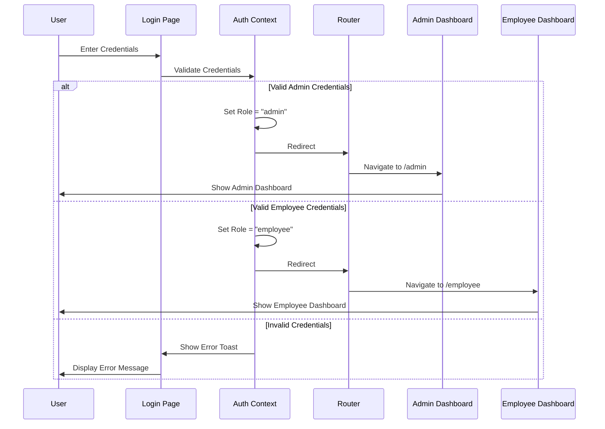
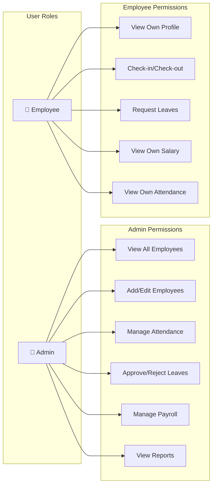
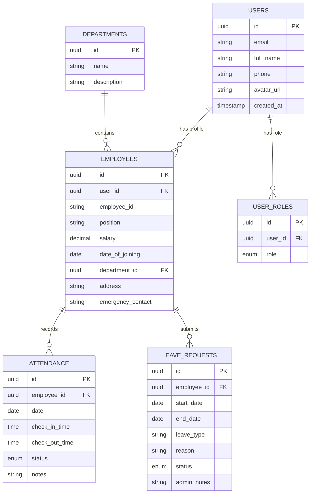
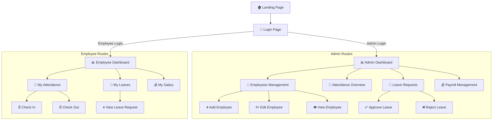
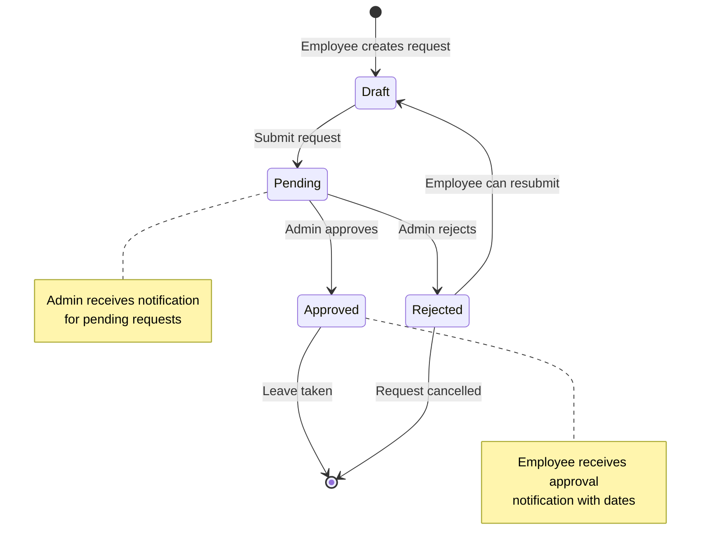
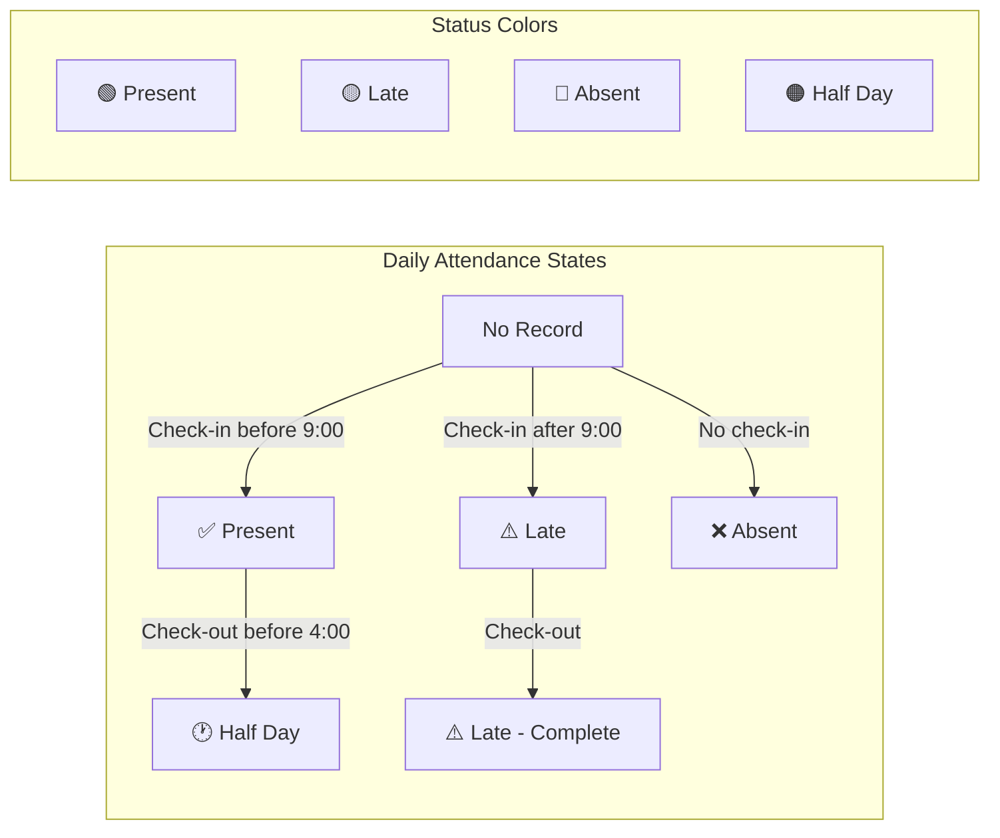
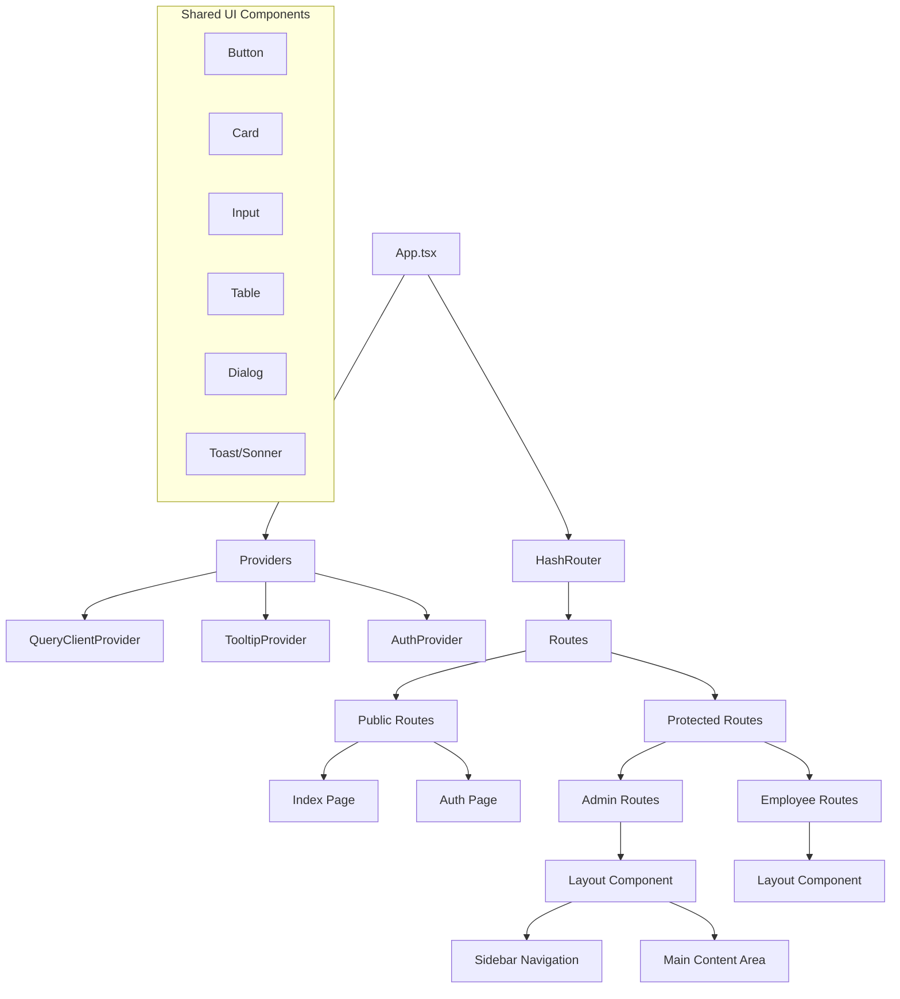

# Mini HR Management System

A modern HR Management System prototype built with React, TypeScript, and Tailwind CSS.

## 🚀 Live Demo

**URL**: https://lovable.dev/projects/13ed195a-7fba-4886-bfc8-1d16f12435cd

### Demo Credentials
- **Admin Access**: `admin@company.com` / `admin123`
- **Employee Access**: `employee@company.com` / `employee123`

---

## 📊 System Architecture Diagrams

### 1. High-Level System Architecture



### 2. User Authentication Flow



### 3. Role-Based Access Control (RBAC)



### 4. Database Entity Relationship Diagram



### 5. Application Navigation Flow



### 6. Leave Request State Machine



### 7. Attendance Status Flow



### 8. Component Hierarchy



---

## 🛠️ Technology Stack

| Category | Technology |
|----------|------------|
| **Frontend Framework** | React 18 |
| **Language** | TypeScript |
| **Styling** | Tailwind CSS |
| **UI Components** | shadcn/ui |
| **Routing** | React Router v6 |
| **State Management** | React Query (TanStack Query) |
| **Build Tool** | Vite |
| **Icons** | Lucide React |
| **Notifications** | Sonner |

---

## 📁 Project Structure

```
src/
├── components/
│   ├── layout/
│   │   └── Layout.tsx          # Main layout with sidebar
│   └── ui/                     # shadcn/ui components
├── contexts/
│   └── AuthContext.tsx         # Authentication context
├── data/
│   └── mock/                   # Mock data for prototype
│       ├── employees.ts
│       ├── attendance.ts
│       ├── leaves.ts
│       └── index.ts
├── hooks/
│   ├── use-mobile.tsx
│   └── use-toast.ts
├── pages/
│   ├── admin/                  # Admin pages
│   │   ├── AdminDashboard.tsx
│   │   ├── Employees.tsx
│   │   ├── Attendance.tsx
│   │   ├── LeaveRequests.tsx
│   │   └── Payroll.tsx
│   ├── employee/               # Employee pages
│   │   ├── EmployeeDashboard.tsx
│   │   ├── EmployeeAttendance.tsx
│   │   ├── EmployeeLeaves.tsx
│   │   └── EmployeeSalary.tsx
│   ├── Auth.tsx               # Login page
│   ├── Index.tsx              # Landing page
│   └── NotFound.tsx           # 404 page
├── App.tsx                    # Main app component
├── main.tsx                   # Entry point
└── index.css                  # Global styles
```

---

## 🚀 Getting Started

### Prerequisites
- Node.js 18+ 
- npm or bun

### Installation

```bash
# Clone the repository
git clone <YOUR_GIT_URL>

# Navigate to project directory
cd <YOUR_PROJECT_NAME>

# Install dependencies
npm install

# Start development server
npm run dev
```

### Build for Production

```bash
npm run build
```

### Deploy to GitHub Pages

1. Push code to GitHub repository
2. Go to **Settings** → **Pages**
3. Set Source to **GitHub Actions** or deploy from `dist` folder
4. Access at: `https://yourusername.github.io/repo-name/`

---

## 📝 Features

### Admin Features
- ✅ Dashboard with statistics overview
- ✅ Employee management (CRUD operations)
- ✅ Attendance tracking and reports
- ✅ Leave request approval/rejection
- ✅ Payroll management

### Employee Features
- ✅ Personal dashboard
- ✅ Check-in/Check-out for attendance
- ✅ Leave request submission
- ✅ Salary slip viewing
- ✅ Attendance history

---

## 🔐 Security Features

- Role-based access control (Admin/Employee)
- Protected routes with authentication guards
- Session management via Auth Context

---

## 📄 License

This project is for educational and demonstration purposes.
